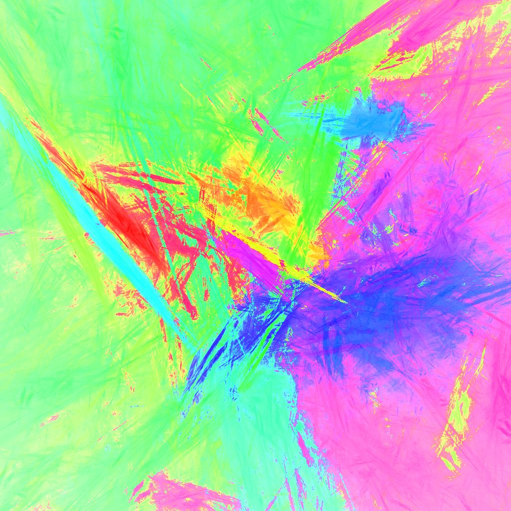

# ifs_images
A little playground for iterated function systems. These
are fractals not unlike the more popular [Mandelbrot](https://en.wikipedia.org/wiki/Mandelbrot_set).

The decent excercise and somewhat fun to program. The result
tend to be fairly psychedlic (and have very little use).

This code depends on 
* libjpeg for the images
* G++ for building
* an x86-64 due to platform specfic optimization.

Luckily these are (still) fairly common in 2022.

Following commands will first build and next run the program.
*`make `
*`./ifs example.jpg`

On newer hardware it takes about 10s for the "example.jpg" to be 
saved to disk, thereafter the program keeps improving the image 
for another hour.
